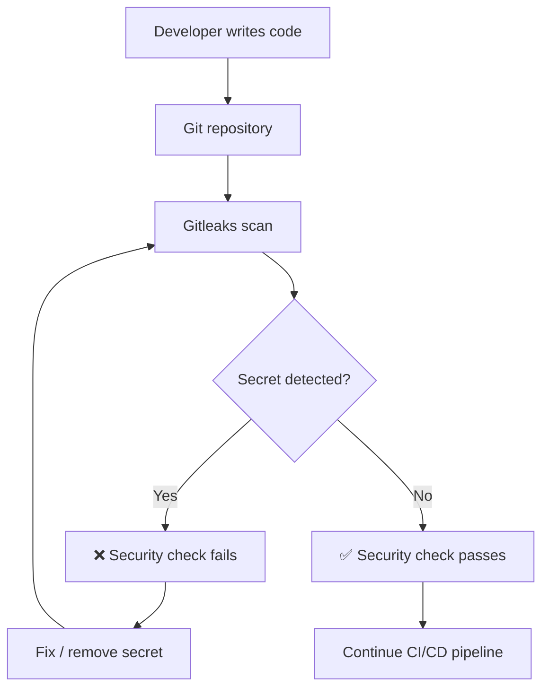
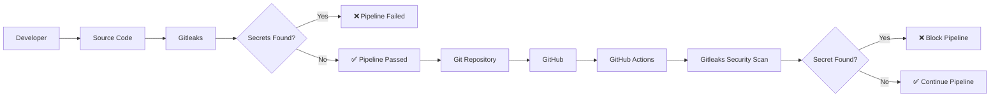
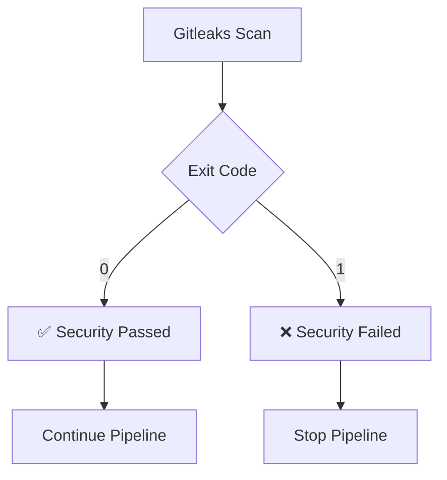
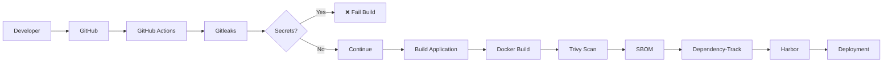
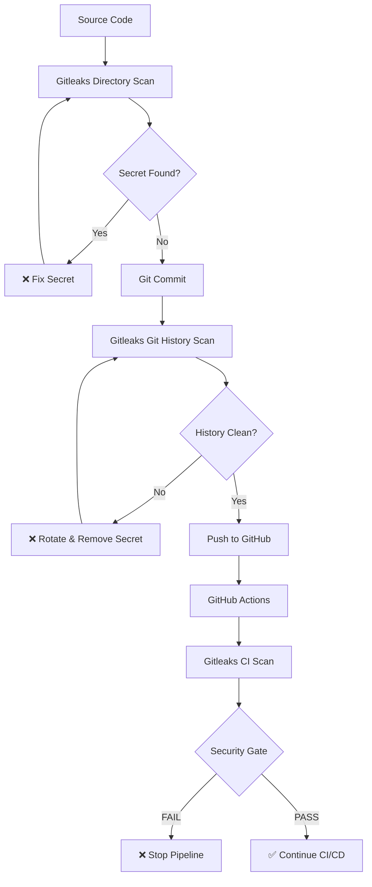

Absolutely. For a project you're going to share on GitHub, the README should document the **entire lab journey**, not just the final commands.

I'll structure it as a proper DevSecOps project README with:

* Project overview
* Architecture diagram
* Tools used
* Prerequisites
* Gitleaks installation
* Git repository setup
* Custom `.gitleaks.toml`
* Creating intentional test secrets
* Working-directory scanning
* Exit codes
* JSON report generation
* Git history scanning
* Secret remediation
* GitHub authentication with SSH
* GitHub repository setup
* GitHub Actions next step
* Troubleshooting
* Interview concepts
* Project structure

For the visuals, I'm using **GitHub-rendered Mermaid diagrams**, so you don't need to maintain separate image files and they display directly in the README.

Replace your current `README.md` with this:

# 🔐 Gitleaks Secret Scanning Lab

A hands-on **DevSecOps secret-scanning project** demonstrating how to detect hardcoded credentials and sensitive information using **Gitleaks**.

This lab covers secret detection at multiple stages:

* Working-directory scanning
* Custom Gitleaks rules
* Git history scanning
* JSON security reports
* Exit-code based security gates
* GitHub repository integration
* CI/CD integration preparation

The project is designed as a practical learning lab and can also be used as a portfolio project for demonstrating **DevSecOps security practices**.

---

## 📌 Project Overview

Hardcoded secrets are a common security problem in software development.

Examples include:

* AWS Access Keys
* AWS Secret Keys
* Database passwords
* GitHub tokens
* API keys
* Cloud credentials
* Private keys

A developer may accidentally commit a secret into a Git repository.

Gitleaks helps detect these secrets before they reach production.

### Security Flow



---

# 🏗️ Project Architecture



---

# 🛠️ Technologies Used

| Tool           | Purpose                   |
| -------------- | ------------------------- |
| Git            | Version control           |
| GitHub         | Source-code repository    |
| Gitleaks       | Secret detection          |
| Bash           | Automation and commands   |
| TOML           | Gitleaks configuration    |
| JSON           | Security scan reports     |
| GitHub Actions | CI/CD security automation |

---

# 📁 Project Structure

```text
gitleaks-secret-scanning-lab/
│
├── .github/
│   └── workflows/
│       └── gitleaks.yml
│
├── docs/
│
├── src/
│   └── config-example.py
│
├── tests/
│
├── .gitignore
├── .gitleaks.toml
├── README.md
└── ...
```

---

# 🔎 What We Will Learn

This lab demonstrates the following security workflow:

```text
Source Code
     |
     v
Gitleaks Directory Scan
     |
     v
Custom Rules
     |
     v
Secret Detection
     |
     +----------------------+
     |                      |
     v                      v
Secret Found           No Secret
     |                      |
     v                      v
Exit Code 1             Exit Code 0
     |                      |
     v                      v
Pipeline FAIL           Pipeline PASS
```

We will also scan the Git history:

```text
Working Directory
       |
       v
     Git
       |
       v
  Git History
       |
       v
Gitleaks Git Scan
       |
       v
Secret Detection
```

---

# 1️⃣ Prerequisites

The lab uses an Ubuntu server.

Verify the operating system:

```bash
cat /etc/os-release
```

Verify Git:

```bash
git --version
```

Verify curl:

```bash
curl --version
```

---

# 2️⃣ Install Gitleaks

Verify whether Gitleaks is already installed:

```bash
gitleaks version
```

Example:

```text
8.30.1
```

Verify the binary location:

```bash
which gitleaks
```

Example:

```text
/usr/local/bin/gitleaks
```

> The exact Gitleaks version may change over time.

---

# 3️⃣ Create the Project Directory

Create the DevSecOps project directory:

```bash
mkdir -p ~/devsecops-daily-projects
cd ~/devsecops-daily-projects
```

Create the project:

```bash
mkdir gitleaks-secret-scanning-lab
cd gitleaks-secret-scanning-lab
```

---

# 4️⃣ Initialize Git

Initialize Git:

```bash
git init
```

Rename the default branch to `main`:

```bash
git branch -m main
```

Configure `main` as the default branch for future repositories:

```bash
git config --global init.defaultBranch main
```

Verify the current branch:

```bash
git symbolic-ref --short HEAD
```

Expected:

```text
main
```

---

# 5️⃣ Create the Project Structure

Create the required directories:

```bash
mkdir -p docs
mkdir -p src
mkdir -p tests
mkdir -p .github/workflows
```

Create the configuration files:

```bash
touch README.md
touch .gitignore
touch .gitleaks.toml
```

---

# 6️⃣ Create a Safe Configuration Example

We should never store real credentials in source code.

Create:

```bash
nano src/config-example.py
```

Use environment variables instead of hardcoded credentials:

```python
import os

# Example configuration.
# Secrets should come from environment variables
# or a dedicated secret-management system.

AWS_ACCESS_KEY_ID = os.getenv("AWS_ACCESS_KEY_ID")
AWS_SECRET_ACCESS_KEY = os.getenv("AWS_SECRET_ACCESS_KEY")

DB_PASSWORD = os.getenv("DB_PASSWORD")

GITHUB_TOKEN = os.getenv("GITHUB_TOKEN")

STRIPE_API_KEY = os.getenv("STRIPE_API_KEY")
```

Verify:

```bash
cat src/config-example.py
```

---

# 7️⃣ Configure `.gitignore`

Create:

```bash
nano .gitignore
```

Example:

```gitignore
# Environment files
.env
.env.*
*.env

# Credentials
credentials/
secrets/
*.pem
*.key

# Gitleaks reports
gitleaks-report.json

# Python
__pycache__/
*.pyc

# Terraform
.terraform/
*.tfstate
*.tfstate.*
```

The purpose of `.gitignore` is to prevent sensitive or unnecessary files from being tracked by Git.

> Important: `.gitignore` is not a replacement for secret scanning.

---

# 8️⃣ Create Custom Gitleaks Rules

Create the configuration:

```bash
nano .gitleaks.toml
```

Use:

```toml
title = "DevSecOps Gitleaks Lab"

[[rules]]
id = "aws-access-key-id"
description = "Detect AWS Access Key IDs"
regex = '''AKIA[0-9A-Z]{16}'''
keywords = ["AKIA"]

[[rules]]
id = "database-password"
description = "Detect database passwords"
regex = '''(?i)(DB_PASSWORD|DATABASE_PASSWORD)\s*=\s*["'][^"']+["']'''
keywords = ["DB_PASSWORD", "DATABASE_PASSWORD"]

[[rules]]
id = "github-token"
description = "Detect GitHub Personal Access Tokens"
regex = '''gh[pousr]_[A-Za-z0-9_]{20,}'''
keywords = ["ghp_", "gho_", "ghu_", "ghs_", "ghr_"]

[[rules]]
id = "stripe-api-key"
description = "Detect Stripe API keys"
regex = '''sk_(?:live|test)_[A-Za-z0-9]{16,}'''
keywords = ["sk_live_", "sk_test_"]
```

Verify:

```bash
cat .gitleaks.toml
```

---

# 9️⃣ Understand the Custom Rules

### AWS Access Key

```regex
AKIA[0-9A-Z]{16}
```

Detects an AWS-style access key beginning with:

```text
AKIA
```

followed by 16 uppercase letters or numbers.

---

### Database Password

```regex
(?i)(DB_PASSWORD|DATABASE_PASSWORD)\s*=\s*["'][^"']+["']
```

Detects assignments such as:

```text
DB_PASSWORD="password"
```

or:

```text
DATABASE_PASSWORD='password'
```

---

### GitHub Token

```regex
gh[pousr]_[A-Za-z0-9_]{20,}
```

Detects common GitHub token prefixes such as:

```text
ghp_
gho_
ghu_
ghs_
ghr_
```

---

### Stripe API Key

```regex
sk_(?:live|test)_[A-Za-z0-9]{16,}
```

Detects Stripe-style keys beginning with:

```text
sk_live_
```

or:

```text
sk_test_
```

---

# 🔟 Create Intentional Test Secrets

For learning purposes, fake secrets can be created to verify that Gitleaks works.

Example:

```bash
cat > test-secret.txt <<'EOF'
AWS_ACCESS_KEY_ID=AKIA1234567890ABCDEF
EOF
```

This is an intentionally fake value.

**Never use real credentials in this lab.**

Run:

```bash
gitleaks dir . --config .gitleaks.toml --verbose
```

Gitleaks should detect the test secret.

Expected:

```text
Finding: AWS_ACCESS_KEY_ID=AKIA1234567890ABCDEF
RuleID: aws-access-key-id
File: test-secret.txt
```

---

# 1️⃣1️⃣ Gitleaks Directory Scan

The modern directory scan command is:

```bash
gitleaks dir .
```

With our custom configuration:

```bash
gitleaks dir . --config .gitleaks.toml
```

For detailed output:

```bash
gitleaks dir . --config .gitleaks.toml --verbose
```

Example successful scan:

```text
INF no leaks found
```

Example failed scan:

```text
WRN leaks found: 5
```

---

# 1️⃣2️⃣ Understanding Exit Codes

This is one of the most important DevSecOps concepts.

After a scan:

```bash
echo $?
```

### Exit code 0

```text
0
```

means:

```text
No secrets detected
```

The pipeline can continue.

### Exit code 1

```text
1
```

means:

```text
Secret(s) detected
```

The security gate can fail the pipeline.

---

# 🔐 Security Gate



This behavior is extremely useful in Jenkins and GitHub Actions.

---

# 1️⃣3️⃣ Generate a JSON Report

A Gitleaks report can be generated in JSON format:

```bash
gitleaks dir . \
  --config .gitleaks.toml \
  --report-format json \
  --report-path /tmp/gitleaks-report.json
```

Check the report:

```bash
cat /tmp/gitleaks-report.json
```

Example information includes:

```json
{
  "RuleID": "aws-access-key-id",
  "File": "src/config-example.py",
  "StartLine": 5,
  "EndLine": 5
}
```

### Why store the report outside the project?

If the report contains the detected secret, scanning the report itself can cause Gitleaks to detect the same secrets again.

Therefore:

```text
❌ gitleaks-report.json inside scanned directory

✅ /tmp/gitleaks-report.json
```

For CI/CD, reports can instead be stored as secure build artifacts.

---

# 1️⃣4️⃣ Git History Scanning

Directory scanning checks the current files.

Git history scanning checks committed content.

Use:

```bash
gitleaks git . --config .gitleaks.toml --verbose
```

Example:

```text
1 commits scanned.
no leaks found
```

If a secret exists in Git history:

```text
leaks found
```

and Gitleaks returns:

```text
1
```

---

# 🔄 Directory Scan vs Git Scan

| Command          | Purpose                          |
| ---------------- | -------------------------------- |
| `gitleaks dir .` | Scan current files               |
| `gitleaks git .` | Scan Git repository history      |
| `gitleaks stdin` | Scan data provided through stdin |

Conceptually:

```text
gitleaks dir
     |
     └── Current working directory


gitleaks git
     |
     └── Git repository history
```

---

# 1️⃣5️⃣ Secret Remediation Exercise

An important lesson is that **deleting a secret from the current file does not necessarily remove it from Git history**.

Example:

```text
Commit 1
   |
   └── Secret committed

Commit 2
   |
   └── Secret deleted
```

The secret can still exist in:

```text
Commit 1
```

Therefore:

```bash
gitleaks git . --config .gitleaks.toml
```

can still detect it.

For this reason, secrets accidentally committed to a real repository should be:

1. Revoked/rotated immediately.
2. Removed from source code.
3. Removed from Git history when appropriate.
4. The repository should be rescanned.

---

# 1️⃣6️⃣ Clean Git History

For this learning lab, because the repository was new and had not yet been pushed, the Git history could safely be recreated.

The process used was:

```bash
rm -rf .git
```

Then:

```bash
git init
git branch -m main
```

After removing the test secrets:

```bash
gitleaks dir . --config .gitleaks.toml
```

Expected:

```text
no leaks found
```

Then a clean commit was created:

```bash
git add .
git commit -m "Initial Gitleaks secret scanning lab"
```

Finally:

```bash
gitleaks git . --config .gitleaks.toml --verbose
```

Expected:

```text
1 commits scanned.
no leaks found
```

---

# 1️⃣7️⃣ Create the First Clean Commit

Check:

```bash
git status
```

Stage the files:

```bash
git add .
```

Commit:

```bash
git commit -m "Initial Gitleaks secret scanning lab"
```

Verify:

```bash
git log --oneline
```

Example:

```text
7325f64 Initial Gitleaks secret scanning lab
```

---

# 1️⃣8️⃣ Verify the Git Repository

Check:

```bash
git status
```

Expected:

```text
On branch main
nothing to commit, working tree clean
```

Run the working-directory scan:

```bash
gitleaks dir . --config .gitleaks.toml
```

Expected:

```text
no leaks found
```

Run the Git history scan:

```bash
gitleaks git . --config .gitleaks.toml
```

Expected:

```text
no leaks found
```

At this stage both security checks pass.

---

# 1️⃣9️⃣ Create the GitHub Repository

Create an empty GitHub repository named:

```text
gitleaks-secret-scanning-lab
```

Do not initialize it with:

* README
* `.gitignore`
* License

because these files already exist locally.

---

# 2️⃣0️⃣ Configure GitHub SSH Authentication

Generate an SSH key:

```bash
ssh-keygen -t ed25519 -C "devsecops-github"
```

Display the public key:

```bash
cat ~/.ssh/id_ed25519.pub
```

Copy the complete public key.

In GitHub:

```text
Settings
   ↓
SSH and GPG keys
   ↓
New SSH key
```

Add the public key.

Test:

```bash
ssh -T git@github.com
```

A successful authentication message confirms that SSH authentication is working.

---

# 2️⃣1️⃣ Configure the GitHub Remote

Set the SSH remote:

```bash
git remote set-url origin git@github.com:SabadevOps/gitleaks-secret-scanning-lab.git
```

Verify:

```bash
git remote -v
```

Expected:

```text
origin  git@github.com:SabadevOps/gitleaks-secret-scanning-lab.git (fetch)
origin  git@github.com:SabadevOps/gitleaks-secret-scanning-lab.git (push)
```

---

# 2️⃣2️⃣ Push the Project

Before pushing, perform a final security scan:

```bash
gitleaks dir . --config .gitleaks.toml
```

Then:

```bash
gitleaks git . --config .gitleaks.toml
```

Both should return:

```text
no leaks found
```

Then push:

```bash
git push -u origin main
```

---

# 2️⃣3️⃣ GitHub Actions Integration

The next stage of this project is automatic secret scanning whenever code is pushed.

Create:

```text
.github/workflows/gitleaks.yml
```

The workflow will eventually provide:

```text
Developer
    |
    v
git push
    |
    v
GitHub
    |
    v
GitHub Actions
    |
    v
Gitleaks
    |
    v
Security Gate
   / \
  /   \
FAIL  PASS
```

A future workflow can automatically scan:

* Pushes
* Pull requests
* Branches
* Commits

---

# 🔒 DevSecOps CI/CD Security Model

The completed security workflow can be extended into:



This can later become part of a complete **DevSecOps CI/CD pipeline**.

---

# 🧪 Useful Commands

### Check Gitleaks version

```bash
gitleaks version
```

### Directory scan

```bash
gitleaks dir .
```

### Directory scan with custom rules

```bash
gitleaks dir . --config .gitleaks.toml
```

### Verbose scan

```bash
gitleaks dir . --config .gitleaks.toml --verbose
```

### Git history scan

```bash
gitleaks git . --config .gitleaks.toml
```

### JSON report

```bash
gitleaks dir . \
  --config .gitleaks.toml \
  --report-format json \
  --report-path /tmp/gitleaks-report.json
```

### Git status

```bash
git status
```

### Git history

```bash
git log --oneline
```

### Git remote

```bash
git remote -v
```

---

# ⚠️ Important Security Practices

Never commit:

```text
.env
AWS credentials
Private SSH keys
Database passwords
GitHub tokens
Cloud API keys
Production credentials
TLS private keys
Service-account credentials
```

Use:

* AWS Secrets Manager
* Azure Key Vault
* HashiCorp Vault
* Kubernetes Secrets with appropriate controls
* Environment variables
* CI/CD secret stores

Gitleaks is a detection layer. It should **not** be treated as a replacement for proper secrets management.

---

# 🎯 DevSecOps Interview Questions

## 1. What is Gitleaks?

Gitleaks is an open-source secret-scanning tool that detects hardcoded credentials and sensitive information in source code and Git repositories.

---

## 2. Why is secret scanning important?

Hardcoded credentials can allow unauthorized access to:

* Cloud infrastructure
* Databases
* APIs
* Source-code repositories
* Production systems

Secret scanning helps detect these credentials before they cause a security incident.

---

## 3. What is the difference between `gitleaks dir` and `gitleaks git`?

`gitleaks dir` scans files in the current directory.

`gitleaks git` scans Git repository history.

---

## 4. What does exit code 1 mean?

It indicates that Gitleaks detected one or more leaks.

This non-zero exit code can be used to fail a CI/CD pipeline.

---

## 5. Why should a secret be rotated after accidental exposure?

Deleting the secret from the source code does not make the credential itself invalid.

The credential should be revoked or rotated so that the exposed value can no longer be used.

---

## 6. Is `.gitignore` enough to protect secrets?

No.

`.gitignore` helps prevent files from being tracked, but it does not detect secrets inside source code.

Secret scanning should still be implemented.

---

## 7. Can Gitleaks scan Git history?

Yes.

Example:

```bash
gitleaks git . --config .gitleaks.toml
```

---

## 8. Can Gitleaks use custom rules?

Yes.

Custom rules can be defined in:

```text
.gitleaks.toml
```

---

## 9. How can Gitleaks be integrated into Jenkins?

A Jenkins pipeline can execute:

```bash
gitleaks dir . --config .gitleaks.toml
```

If Gitleaks returns exit code `1`, Jenkins can fail the stage and stop the pipeline.

---

## 10. How can Gitleaks be integrated with GitHub Actions?

A GitHub Actions workflow can execute Gitleaks automatically during:

* Push
* Pull request
* Branch builds

This creates an automated security gate.

---

# 📚 Learning Outcome

After completing this project, you should understand:

* Secret scanning
* Gitleaks
* Custom regex rules
* Git history scanning
* Security exit codes
* JSON security reports
* GitHub SSH authentication
* CI/CD security gates
* DevSecOps security practices

---

# 🚀 Future Improvements

The project can be extended with:

* [ ] GitHub Actions Gitleaks workflow
* [ ] Jenkins Gitleaks stage
* [ ] Docker-based Gitleaks scanning
* [ ] SARIF reports
* [ ] Pull-request security gates
* [ ] Trivy integration
* [ ] GitLeaks + Jenkins
* [ ] SBOM generation
* [ ] Dependency-Track
* [ ] Harbor image scanning
* [ ] Complete DevSecOps pipeline

---

# 👨‍💻 Project Status

Current implementation:

```text
✅ Gitleaks installed
✅ Git repository initialized
✅ Main branch configured
✅ Custom Gitleaks configuration
✅ AWS secret detection
✅ Database password detection
✅ GitHub token detection
✅ Stripe API-key detection
✅ Working-directory scanning
✅ Git history scanning
✅ JSON report generation
✅ Secret-remediation exercise
✅ Clean Git history
✅ GitHub SSH authentication setup
⬜ GitHub Actions integration
⬜ Jenkins integration
⬜ Complete DevSecOps pipeline
```

---

# 📌 Final Security Flow



---

## ⭐ Key DevSecOps Principle

> **Detect secrets as early as possible.**

The earlier a secret is detected, the easier and safer it is to remove.

```text
Developer
    ↓
Pre-Commit / Local Scan
    ↓
Git
    ↓
Pull Request
    ↓
CI/CD Security Scan
    ↓
Build
    ↓
Deploy
```

Secret scanning should be part of the development lifecycle rather than something performed only after deployment.

### Put it into your project

Since you're already inside:

```bash
~/devsecops-daily-projects/gitleaks-secret-scanning-lab
```

you can replace the README with the content above.

One correction from our earlier work: **don't include your personal email, name, or other account-specific information in this README.** The README above intentionally uses generic project information so you can share the repository publicly.

After saving it, run:

```bash
git status
```

Then:

```bash
gitleaks dir . --config .gitleaks.toml
```

You should still get:

```text
no leaks found
```

Then commit:

```bash
git add README.md
git commit -m "Add complete project documentation"
```

And verify the history one more time:

```bash
gitleaks git . --config .gitleaks.toml
```

Expected:

```text
no leaks found
```

**After that, we'll push this clean repository to GitHub and create the actual `gitleaks.yml` GitHub Actions workflow.**
